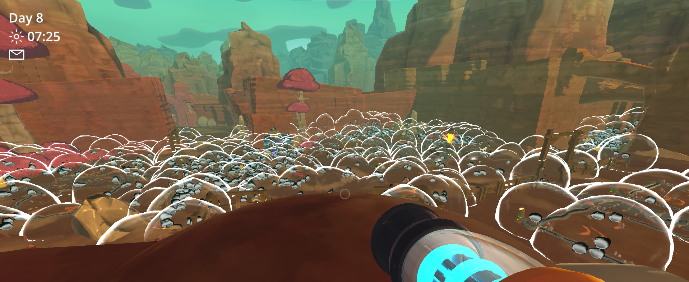

# MaterialSlimes

Material Slimes is basically an extension mod to **Glue Slimes**! This adds in 6+ new slimes which are based off of Materials! Plastic, Wood, Glass, etc. Walk among the Slime Rancher world with Material Slimes roaming it!

NOTE: Please uninstall Glue Slimes if you have it installed while playing this. This mod adds in the Glue Slime with better spawning, etc.

## About the mod

**Spawning List (All of these are converted based on its code, can't promise 100% accurate.):**
**-- Common --**
1. *Wood Slimes - 50% - Spawns in the Reef.*
2. *Glue Slimes - 30% - Spawns in the Reef.*
3. *Concrete Slimes - 20% - Spawns in the Ruins & Wilds.*
4. *Cotton Slimes - 20% - Spawns in the Moss Blanket & Reef.*

**-- Semi-Common --**
5. *Copper Slimes - 15% - Spawns in the Wilds.*
6. *Ice Slimes - 12% - Spawns in the Indigo Quarry & Moss Blanket.*
7. *Glass Slimes - 10% - Spawns in the Glass Desert.*
8. *Metal Slimes - 9% - Spawns in the Indigo Quarry.*
9. *Plastic Slimes - 8% - Spawns in the Moss Blanket.*

**-- Rare  --**

10. *Self Discovery Slime - %2 - Spawns Everywhere.*
11. *Light Slime - 1-2% - Spawns from a Self Discovery Slime.*
13. *Dark Slime - 1-2% - Spawns from a Self Discovery Slime.*

**Slime Brief Description:**
1. *Wood Slimes act like any other slime, they should be safe and the most common.*
----------------------------------------------------------------------------------------------------------------------------------------------------------------------------------
2. *Glue Slimes are pretty normal as well, but they're alternate food sources could result to Pink Slimes or Pink Plorts. Explains why they spawn in the Reef.*
----------------------------------------------------------------------------------------------------------------------------------------------------------------------------------
3. *Glass Slimes have not much to say about them besides that sometimes they'll float, they also like meat.*
----------------------------------------------------------------------------------------------------------------------------------------------------------------------------------
4. *Metal Slimes used to look like Tarr Slimes, but morphed into a cute little slime. They may or may not eat their own Plorts or a Rock Slime if there is no other food source. They're plorts are also heavy and will not be vacuumed by the VacPack.*
----------------------------------------------------------------------------------------------------------------------------------------------------------------------------------
5. *Plastic Slimes are sneaky, they'll go into stealth mode(invisible) for a second, then jump right at you! Although, they are very nice creatures.. but may eat a glue plort or two if hungry.*
----------------------------------------------------------------------------------------------------------------------------------------------------------------------------------
6. *Self Discovery Slimes are probably the most powerful out of them all, when it eats.. it'll spawn/summon a Material Slime, only one though. Explains the name, right? It'll discover a slime for you. They also like eating Kookadoba's or Phase Lemons.
----------------------------------------------------------------------------------------------------------------------------------------------------------------------------------
7. *Concrete Slimes may not move too much.. besides their inner instincts or looking for food. They're made out of concrete after all, right?  These slimes also love water, they'll eat Puddle Plorts or Fresh Water (Which doesn't produce plorts). They can also eat Rock Plorts as additional food. Their plorts are heavy like the Metal Plorts, don't expect them to be vacuumed.*
----------------------------------------------------------------------------------------------------------------------------------------------------------------------------------
8. *Cotton Slimes- Wooo! Where is it going? Well, its flying away. These slimes are very light and sometimes they'll just fly away, you have to catch them before they fly off somewhere you can't get them.. or put them in a corral that is. Not a normal slime hovering by the way.. I mean you might even see one fly across your screen as you are walking through their spawning zones.*
----------------------------------------------------------------------------------------------------------------------------------------------------------------------------------
9. *Copper Slimes are tiny little teleporters. They'll teleport to an area nearby, a corral should stop them from teleporting outside of it though. Amazingly cute though, might wanna carry a few with you.**
----------------------------------------------------------------------------------------------------------------------------------------------------------------------------------
10. Ice Slimes are very cold! Don't touch it.. you may gain frostbite. Although their plorts have a LOT of value, sometimes it could go up to 90 newbucks (or even higher). Do you know why? Its because Ice made from Ice Plorts can last for hours and hours without melting.. oh how magical, imagine how long you can have a cold drink without even touching it at all.*
----------------------------------------------------------------------------------------------------------------------------------------------------------------------------------
11. *Light Slimes.. created by the Self Discovery Slime itself, they radiate of light and produce Light Plorts! Light Plorts are extremely valuable, its literal light. Make light guns, portals, anything you can think of with this fictional material! Not so fictional now.. are you? Tip: Keep them away from Dark Slimes.*
----------------------------------------------------------------------------------------------------------------------------------------------------------------------------------
12. *Dark Slimes, oh no.. if you see one of these, you may want to get rid of it. Its a literal miniature Tarr if you think about it- When these slimes eat other slimes they produce a copy of themselves, making it endless hunger.. producing more and more until there is no more slimes left. Here is an example of how bad it could get for your Ranch if you let these little guys get near your batches of slimes:*

*Here is an example if it goes even further with the process:*

Possibly more slimes to be added in the future! Also, Tarrs will not eat any of the Material Slimes.. as of now. Although, they will still run away from them.. besides the Self Discovery Slime. They will go towards it for food, and once it is satisfied it will just jump around happily as if its all fine.

## Special Thanks

Credits to the [Slime Rancher Modding Server](https://discord.gg/N8Taura) for helping me get started! ^-^